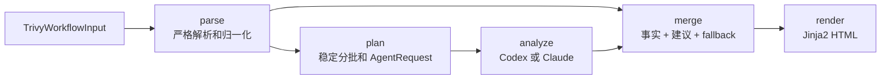
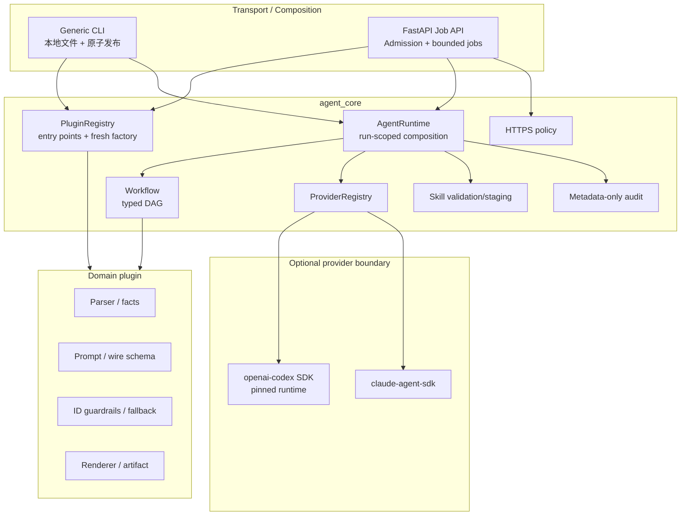
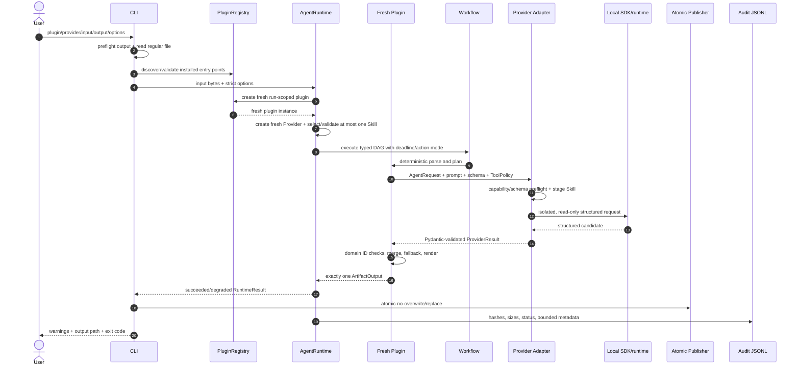

# agent-core：确定性程序 + 本地 AI Agent 通用框架

`agent-core` 用来构建这样的工具：**能确定的步骤由 Python 程序完成，需要推理的步骤才交给
Codex 或 Claude**。程序拥有输入解析、事实、校验、重试策略、fallback、最终工件和副作用权限；
模型只处理一个边界明确、返回值可验证的推理任务。

仓库当前包含：

- `agent-core` `0.1.x`：领域无关的工作流、Provider、Skill、插件注册、CLI、审计和 Web Job API。
- `trivy-ai-report` `0.2.x`：第一个领域插件，把 Trivy JSON v2 转成中文漏洞整改 HTML 报告。
- `ankify-agent` `0.1.x`：来源可追溯的 Anki Basic 卡片 Agent，包含版本化学习策略和七组
  Provider-neutral Eval fixtures。
- 一个完全不依赖 Trivy 的 Toy 插件 fixture，用来证明 Core 可以复用于 Linter Fixer、FinOps
  Optimizer、K8s Log Analyzer 等其他领域。

当前内置 Provider 是 `codex` 和 `claude`。当前 Core Plugin API 是 `1.0`。

> 这个项目不是一个“把整个任务丢给聊天机器人”的包装器。它更接近一个有类型、有审计、
> 有权限边界的工作流运行时。AI 输出始终是不可信候选值，必须经过程序校验后才能进入最终结果。

“本地优先”指工作流运行时、插件、Skill staging、输入处理和工件发布由你的机器控制，不代表
模型推理离线。Codex/Claude SDK 通常会把受限 prompt 发送给相应服务，可能产生费用并受账号、
网络和服务可用性影响。Trivy 插件会尽量减少进入模型的数据，具体字段见
[哪些数据会发给模型](#哪些数据会发给模型)。

## 阅读导航

如果你是第一次使用：

1. 阅读[五分钟快速开始](#五分钟快速开始)。
2. 阅读[怎样判断运行是否真的成功](#怎样判断运行是否真的成功)。
3. 遇到问题查看[用户排障](#用户排障)。

如果你准备开发或扩展：

1. 阅读[架构与职责边界](#架构与职责边界)。
2. 阅读[完整数据流](#完整数据流)。
3. 阅读[开发环境与验证](#开发环境与验证)。
4. 按[开发一个新领域插件](#开发一个新领域插件)创建自己的插件。
5. 遇到集成问题查看[开发者调试手册](#开发者调试手册)。

## 这个框架解决什么问题

普通 Agent 脚本经常把解析、决策、工具调用和写文件都放进一个 prompt，结果会有几个问题：

- 同一个输入可能得到不同的事实、ID 或文件格式。
- 模型失败后没有可用产物，或者异常被伪装成成功。
- Prompt、Provider SDK、领域模型和 Web 服务彼此耦合，第二个业务无法复用。
- 模型拥有的工具权限不清楚，联网、文件写入或执行命令很难审计。
- 并发请求之间可能共享可变状态，造成串数据。

`agent-core` 把任务拆成三种节点：

| 节点 | 适合做什么 | 谁对结果负责 |
| --- | --- | --- |
| `TransformNode` | 解析、归一化、规则计算、分批、合并、校验、渲染 | 确定性程序 |
| `AgentNode` | 解释上下文、生成建议、归纳或研究 | AI 生成候选值，程序校验 |
| `ActionNode` | 创建 PR、改配置、发布、调用有副作用的外部 API | 框架权限门 + 业务实现 |

`TransformNode` 的“确定性”是插件作者必须遵守的设计契约；Python 不会自动证明一个 handler
是纯函数。真正的副作用应显式放进 terminal `ActionNode`，这样调用者才能选择
`disabled`、`dry_run` 或 `apply`。

适合这个框架的任务通常具有以下结构：

```text
读取结构化输入
  → 程序提取不可变事实
  → AI 对受限事实做推理
  → 程序验证并补齐结果
  → 程序生成工件
  → 可选的显式副作用
```

不适合的场景包括：只需要一次自由聊天、无法定义输入/输出契约、或者希望模型不经校验直接拥有
主机 Shell 和写权限的任务。

## 五分钟快速开始

### 1. 准备环境

需要：

- Python `3.10+`；CI 当前验证 Python `3.10` 和 `3.12`。
- [uv](https://docs.astral.sh/uv/getting-started/installation/)；源码仓库推荐使用它管理环境。
- 至少一个已配置凭据的 Provider：Codex 或 Claude。
- 只有扫描自己的镜像时才需要 Trivy；运行仓库自带示例不需要安装 Trivy。

本文的多行 shell 示例默认使用 macOS/Linux 的 Bash/Zsh。Windows PowerShell 的命令名和参数相同，
但续行符使用反引号，环境变量使用 `$env:NAME`，退出码使用 `$LASTEXITCODE`。例如：

```powershell
$env:ANTHROPIC_API_KEY = 'replace-with-your-key'

uv run agent-core run `
  --plugin trivy `
  --provider claude `
  --input examples/trivy-alpine-eosl.json `
  --output reports/quickstart-alpine-claude.html `
  --options-json '{"enrich_web":false,"use_bundled_skill":true}'

$LASTEXITCODE
```

Web 示例在 PowerShell 中建议显式使用 `curl.exe`，避免旧版 PowerShell 的 `curl` alias 与标准 curl
参数不兼容。

在仓库根目录执行：

```bash
uv sync --locked --all-extras
uv run agent-core plugins list
```

正常情况下会看到：

```text
PLUGIN  VERSION  API  NAME
trivy   0.2.0    1.0  Trivy AI Remediation Report
```

如果列表中没有 `trivy`，先不要继续运行，查看[用户排障](#用户排障)。

### 2. 配置 Codex 或 Claude

#### Codex

如果 `codex` 命令不存在，先按
[Codex CLI 官方说明](https://learn.chatgpt.com/docs/codex/cli)安装。然后用 CLI 完成并检查登录：

```bash
codex login
codex login status
```

然后确认 Python SDK 已安装：

```bash
uv run python -c "import openai_codex; print('openai-codex SDK: OK')"
```

需要理解两个不同的组件：

- `PATH` 中的 `codex` CLI 适合登录、查看状态和交互使用。
- `agent-core[codex]` 安装的是 `openai-codex` Python SDK。该 SDK 默认使用与 SDK 匹配的
  bundled/pinned Codex runtime，而不保证使用 `PATH` 中的可执行文件。

两者默认复用 Codex 的本地登录状态，例如 `~/.codex`。因此 `codex login status` 成功是必要的
排查步骤，但“系统里安装过 Codex CLI”不等于当前 Python 环境已经安装 `agent-core[codex]`；
反过来，升级 `PATH` 中的 CLI 也不等于升级 Python SDK 使用的 runtime。

可以查看当前环境中的两个 Python 包版本：

```bash
uv run python -c "import importlib.metadata as m; print('SDK', m.version('openai-codex')); print('runtime', m.version('openai-codex-cli-bin'))"
```

相关官方文档：[Codex CLI](https://learn.chatgpt.com/docs/codex/cli)、
[Codex 认证](https://learn.chatgpt.com/docs/auth)、
[Codex SDK](https://learn.chatgpt.com/docs/codex-sdk)。

#### Claude

本项目中可重复验证的认证方式是设置 Anthropic API key：

```bash
export ANTHROPIC_API_KEY='replace-with-your-key'
test -n "$ANTHROPIC_API_KEY" && echo 'ANTHROPIC_API_KEY configured'
uv run python -c "import claude_agent_sdk; print('claude-agent-sdk: OK')"
```

不要把 key 写进仓库、`--options-json`、URL query、报告或测试 fixture。SDK 不会因为仓库里存在
`.env` 就由本项目自动加载它。Claude.ai/Claude Code 订阅也不应被假定为这个 SDK 的 API 额度。

### 3. 运行仓库自带 Trivy 示例

下面的命令会真正调用 Codex，只是禁止它联网检索。`enrich_web=false` **不是关闭 AI**：

```bash
uv run agent-core run \
  --plugin trivy \
  --provider codex \
  --input examples/trivy-alpine-eosl.json \
  --output reports/quickstart-alpine.html \
  --options-json '{"enrich_web":false,"use_bundled_skill":true}'
```

使用 Claude 时只替换 Provider：

```bash
uv run agent-core run \
  --plugin trivy \
  --provider claude \
  --input examples/trivy-alpine-eosl.json \
  --output reports/quickstart-alpine-claude.html \
  --options-json '{"enrich_web":false,"use_bundled_skill":true}'
```

命令会自动创建输出目录。输出已存在时默认拒绝覆盖；确认要替换时加 `--force`。

运行后立即检查退出码：

```bash
echo $?
```

在 Windows PowerShell 中使用 `$LASTEXITCODE`。

### 4. 扫描自己的镜像

如果还没有 Trivy，先参考
[Trivy 官方安装说明](https://www.trivy.dev/docs/latest/getting-started/installation/)完成安装并检查：

```bash
trivy --version
```

macOS/Linux Homebrew 用户可以使用 `brew install trivy`；Windows 可从官方 release 下载对应
archive。扫描本地容器镜像还要求 Trivy 能访问相应 container engine/registry，私有 registry 需要
先按组织方式登录。

然后让 Trivy 生成 native JSON：

```bash
trivy image \
  --format json \
  --output trivy-report.json \
  your-image:tag
```

再把它交给同一个通用入口：

```bash
uv run agent-core run \
  --plugin trivy \
  --provider codex \
  --input trivy-report.json \
  --output reports/trivy-report.html \
  --options-json '{"enrich_web":false}'
```

仓库中的 `examples/trivy-*.json` 是经过整理的教学输入，不是 2026 年重新扫描的实时结果。
`examples/analysis-*.json` 更不是 `agent-core run` 的输入：它们是手工固定的 Agent 响应，只用于
离线重建仓库里的教学 HTML。来源和限制见 [`examples/SOURCES.md`](examples/SOURCES.md)。

## 怎样判断运行是否真的成功

不要只看“HTML 文件存在”。同时看终端 warning、退出码和报告顶部状态。

| 退出码 | 是否可能已有 HTML | 含义 | 应该怎么做 |
| ---: | --- | --- | --- |
| `0` | 是 | 完整工作流成功 | 打开报告并人工评审建议 |
| `3` | 是 | 插件生成了 partial/fallback 工件，状态为 `degraded` | 查看 warning；不要当作完整 AI 成功 |
| `2` | 通常否 | 通用参数、options、插件/Provider 装配或本地路径前检错误 | 修正命令或配置 |
| `1` | 通常否 | 工作流执行错误或未预期编程错误；当前 Trivy 内容解析错误也落在这里 | 检查输入；开发者查看 typed error |
| `130` | 否或未发布 | 用户中断或取消 | 确认需求后重新运行 |

Trivy 的 Provider 调用失败、超时、结构化响应不合格，甚至某些 Provider schema 配置错误，都可能
被领域 fallback 接住。此时 Python 仍会基于扫描事实生成保守建议、原子写出 HTML，并返回 `3`。
例如：

```text
warning: codex batch-0001 分析失败（provider_configuration），已使用本地保守规则。
reports/trivy.html
```

这表示：

- 扫描事实和报告仍然可用。
- 这一批建议没有使用有效的模型结果。
- 你需要修复 Provider 问题后重新运行，或明确接受本地保守规则。

在使用 `set -e` 的 shell 或 CI 中，退出码 `3` 会让步骤失败，即使报告已经写出。可以按业务策略
显式区分：

```bash
set +e
uv run agent-core run \
  --plugin trivy \
  --provider codex \
  --input examples/trivy-alpine-eosl.json \
  --output reports/ci-report.html \
  --options-json '{"enrich_web":false}' \
  --force
code=$?
set -e

case "$code" in
  0) echo 'complete report' ;;
  3) echo 'degraded report: manual review required' ;;
  *) exit "$code" ;;
esac
```

## CLI 完整使用说明

查看帮助：

```bash
uv run agent-core --help
uv run agent-core run --help
uv run agent-core serve --help
```

通用运行形式：

```text
agent-core run
  --plugin ID
  --provider NAME
  --input PATH
  --output PATH
  [--model NAME]
  [--skill PATH]
  [--options-json OBJECT]
  [--action-mode disabled|dry_run|apply]
  [--timeout-seconds SECONDS]
  [--force]
```

| 参数 | 含义 | 当前默认值/注意事项 |
| --- | --- | --- |
| `--plugin` | 已安装的领域插件 ID | 用 `plugins list` 查看 |
| `--provider` | Provider 名称 | Core 当前只有 `codex`、`claude` |
| `--input` | 一个本地普通文件 | CLI 不接受目录；内容由插件解析 |
| `--output` | 最终工件路径 | 默认不覆盖；父目录可自动创建 |
| `--model` | 覆盖 Provider 默认模型 | 不传时可能在报告中显示 `provider-default` |
| `--skill` | 一个 Skill 目录或 `SKILL.md` | 替换插件 bundled Skill，不是追加；每个 run 最多一个 |
| `--options-json` | 直接传给插件的严格 JSON object | 默认 `{}`；布尔值写 `true/false`，不是字符串 |
| `--action-mode` | 本次 run 的最高副作用权限 | 默认 `disabled` |
| `--timeout-seconds` | 整个 workflow 总 deadline | 不传时 Runtime 默认 `900` 秒 |
| `--force` | 原子替换已有输出 | 不加时 race-safe 地拒绝覆盖 |

Runtime 默认单次 Agent attempt 上限为 `300` 秒；增加总 deadline 不会自动改变这个上限。默认
`max_attempts=3` 表示最多三次尝试，即首次加最多两次重试。Provider adapter 自身不偷偷重试，
所有重试预算由 `AgentNode` 统一管理。

`--action-mode` 是通用框架能力。当前 Trivy 工作流没有 `ActionNode`，所以把它设为 `apply` 不会
修改镜像、依赖文件或仓库。未来插件只有把副作用实现成 terminal `ActionNode` 后，模式才有实际
效果：

- `disabled`：不授权执行，ActionNode 状态为 `skipped`。
- `dry_run`：只调用 preview handler。
- `apply`：才调用 apply handler。

## Trivy 插件使用说明

### 输入契约

当前插件只支持：

- UTF-8 JSON。
- 根节点必须是 JSON object。
- `SchemaVersion` 必须严格等于 `2`。
- 顶层必须有非空 `ArtifactName`、`ArtifactType`；如果提供 `Results`，它必须是 array 或 null，
  缺失/null 按空 array 处理。每个存在的 result 必须有非空 `Target`。
- vulnerability 至少需要 `VulnerabilityID`、`PkgName`、`InstalledVersion`；其余字段会按领域
  规则校验或采用明确的未知值。

插件会在调用 AI 前完成：解析、字段归一化、稳定 `finding_id` 计算、去重、严重度和可修复性
计算。模型无权修改 CVE、Severity、包名、InstalledVersion、FixedVersion、OS 或 finding ID。

### Options

| 字段 | 类型 | 默认值 | 作用 |
| --- | --- | --- | --- |
| `enrich_web` | `bool` | `false` | 是否允许 Provider 使用只读 Web 搜索/抓取来补充证据 |
| `batch_size` | `int \| null` | `null` | 每批 finding 数，范围 `1..100`；离线默认 25、联网默认 10 |
| `use_bundled_skill` | `bool` | `true` | 是否加载插件随 wheel 发布的 Trivy remediation Skill |

CLI 例子：

```bash
--options-json '{"enrich_web":true,"batch_size":10,"use_bundled_skill":true}'
```

本地 CLI 的 run policy 默认允许插件请求 Web 工具，因此 `enrich_web=true` 会为 Provider 开放
只读联网能力。Web API 还必须由服务启动参数 `--allow-web-enrichment` 二次授权；请求参数不能
扩大服务器权限。

### 哪些数据会发给模型

模型只收到经过限长和分批的字段：

- artifact/target 类型和名称；
- `finding_id`、CVE、包名、已安装版本、Trivy FixedVersion、状态、严重度、标题；
- OS family/version/EOSL；
- 是否允许联网和领域整改规则。

以下内容不会进入 Trivy Agent prompt：原始 Description、Trivy 引用 URL、完整原始 JSON。它们可
由 Python renderer 展示，但不会被当作模型指令。输入中的所有字符串仍被 prompt 明确标成不可信
数据。

### 成功、部分成功和零 finding

真实 DAG 是：



- 全部批次成功且结果完整：报告为 complete，CLI 返回 `0`。
- 某批失败、缺 finding、跨批 ID、重复 ID 或结果 partial：本地规则补齐，报告为 degraded，返回
  `3`。
- 所有批次失败：仍为每个 finding 生成本地保守建议，返回 `3`。
- 输入没有 finding：不会创建 Agent batch，也不会验证 Provider 登录是否可用；会直接渲染空报告。

离线模式会强制把模型返回的 research status 设为 `not_requested` 并清空 evidence。最终建议仍需
人工评审、重新扫描、构建测试和业务回归，不能把模型文本当成已经完成的整改。

## Web Job API

Web 是可选依赖。源码开发环境的 `--all-extras` 已包含它；单独安装包时需要 `[web]`。

### 本机默认启动

```bash
uv run agent-core serve --host 127.0.0.1 --port 8000
```

默认配置：

- 只监听 loopback。
- 未配置 token 时，`/api/v1/*` 在本机也不要求认证。
- 不授权 Web enrichment。
- `max_action_mode=disabled`，ActionNode 会被跳过。
- HTTPS source/sink allowlist 为空，因此不能访问远程 URL。
- `/livez` 和 `/readyz` 不要求认证；它们不暴露凭据。

确认服务：

```bash
curl -sS http://127.0.0.1:8000/livez
curl -sS http://127.0.0.1:8000/readyz
curl -sS http://127.0.0.1:8000/api/v1/plugins
```

`/readyz` 只检查至少有一个插件 descriptor、Provider 名称和已启动的 job manager；它不会登录
Provider，也不会发送网络请求。因此 ready 不代表账号、模型或 SDK 一定可调用。

### 提交、轮询和下载

默认 loopback 且没有设置 token 时，不要发送一个空的 `Authorization: Bearer` header：

```bash
curl -sS -X POST http://127.0.0.1:8000/api/v1/runs \
  -H 'Content-Type: application/json' \
  -d '{
    "plugin_id": "trivy",
    "provider": "codex",
    "source": {
      "type": "inline",
      "data": {
        "SchemaVersion": 2,
        "ArtifactName": "demo:latest",
        "ArtifactType": "container_image",
        "Results": []
      }
    },
    "sink": {"type": "artifact"},
    "options": {
      "model": null,
      "enrich_web": false,
      "timeout_seconds": 300,
      "action_mode": "disabled",
      "parameters": {"use_bundled_skill": true}
    }
  }'
```

POST 返回 `202` 和一个完整状态 object，其中包含 `run_id`。上面的 `Results: []` 只验证 API
链路，不会调用 Provider。要验证认证和 structured output，请提交包含 finding 的真实或仓库示例。

用返回的 ID 轮询：

```bash
curl -sS http://127.0.0.1:8000/api/v1/runs/RUN_ID
```

状态可能是 `queued`、`running`、`succeeded`、`degraded`、`failed` 或 `cancelled`。完成后下载：

```bash
curl -fSLo reports/web-report.html \
  http://127.0.0.1:8000/api/v1/runs/RUN_ID/artifact
```

取消仍在等待或执行的任务：

```bash
curl -sS -X POST http://127.0.0.1:8000/api/v1/runs/RUN_ID/cancel
```

取消会通过 Workflow 传到 Provider SDK，并释放并发许可。它是协作式取消，不应被理解成对所有
第三方网络操作的瞬间强杀保证。

### API 请求契约

所有 API model 都拒绝未知字段。CLI 和 Web options 的层级不同：

- CLI `--options-json` 直接是插件 options。
- Web 的通用字段放在 `options`；插件字段放在 `options.parameters`。
- Web 的 `options.enrich_web` 是经过服务器 policy 检查的专用字段。Trivy 的同名 option 会由
  composition root 注入，不能藏进 `parameters` 绕过服务端权限。

`source` 只能二选一：

```json
{"type":"inline","data":{"SchemaVersion":2,"ArtifactName":"x","ArtifactType":"container_image","Results":[]}}
```

```json
{"type":"https","url":"https://artifacts.example.com/input/trivy.json"}
```

`inline.data` 必须是 JSON object，不接受任意数组或本地路径。`sink` 只能是：

```json
{"type":"artifact"}
```

或 HTTPS PUT：

```json
{"type":"https","url":"https://artifacts.example.com/output/trivy.html"}
```

HTTPS source 和 sink 都必须在服务启动时加入精确 `host:port` allowlist。即使使用 HTTPS sink，
任务完成后的 artifact 仍会暂存在当前进程内，可在 TTL 到期前下载。

状态响应包含：`run_id`、创建/开始/结束时间、`cancellation_requested`、`partial`、`warnings`、
`error {code,message}`、`artifact_available` 和 `artifact_url`。

| HTTP 状态 | 常见含义 |
| ---: | --- |
| `202` | 任务已接收或取消请求已接收 |
| `401` | 服务配置了 token，但 bearer 缺失或错误 |
| `403` | 请求的 Web enrichment 或 action mode 超过服务器权限 |
| `404` | 插件、Provider 或 run 不存在 |
| `409` | 工件还未准备好 |
| `413` | 请求 body 超过上限 |
| `422` | 请求 JSON/schema 错误，或同步 HTTPS admission policy 不通过 |
| `503` | queue/run store 满，或 readiness 不满足；容量错误带 `Retry-After` |

### 非 loopback 和 HTTPS I/O

非 loopback bind 必须设置 bearer token，否则服务拒绝启动：

```bash
export AGENT_CORE_API_TOKEN='replace-with-a-long-random-secret'

uv run agent-core serve \
  --host 0.0.0.0 \
  --port 8000 \
  --allow-https-server artifacts.example.com:443 \
  --allow-web-enrichment \
  --max-action-mode dry_run
```

此时 API 请求增加：

```bash
-H "Authorization: Bearer $AGENT_CORE_API_TOKEN"
```

token 保护 `/api/v1/*`，不保护 `/livez` 和 `/readyz`。生产环境仍应放在 TLS reverse proxy、
受信网关或私有网络后面；内置 Uvicorn 命令不是完整的互联网边缘安全产品。

HTTPS transport 只允许 `https`、精确 allowlist、无 userinfo/fragment/redirect。DNS 返回的每个地址
都必须是公网可路由地址，连接会固定到已经校验的地址，以降低 SSRF、metadata endpoint、重定向
和 DNS rebinding 风险。

默认资源上限：

| 项目 | 默认值 |
| --- | ---: |
| HTTP request body | 10 MiB |
| inline/HTTPS input | 10 MiB |
| output/artifact | 20 MiB |
| queue capacity | 16 |
| job workers | 2 |
| retained run records | 256 |
| terminal run TTL | 3600 秒 |
| API workflow timeout | 300 秒，最大 3600 秒 |
| HTTPS connect/read/write/pool timeout | 5 / 30 / 30 / 5 秒 |
| HTTPS total timeout | 45 秒 |
| HTTPS total/keepalive connections | 20 / 10 |

CLI 只暴露最常用的 Web policy 开关。要修改 queue、TTL、大小或 transport timeout，需要在 Python
composition root 中构造 `WebSettings`/`HttpsIoPolicy` 并调用 `create_app(...)`。

内置 JobManager 是有界的**单进程内存实现**：

- 重启进程会丢失 queue、run 状态和 artifact。
- terminal run 默认完成一小时后过期。
- 不要把多个 Uvicorn worker 的内存当成共享存储。
- 当前 CLI 没有持久化 job backend 的开关；生产多实例需要在 Python 中注入 durable queue/store。

## 用户排障

第一次遇到问题时，按下面顺序排查，不要一开始就修改 prompt：

```bash
# 1. 当前环境是否能发现插件
uv run agent-core plugins list

# 2. CLI 参数是否和当前版本一致
uv run agent-core run --help

# 3. Provider Python SDK 是否安装在同一个 uv 环境
uv run python -c "import openai_codex; print('codex sdk ok')"
uv run python -c "import claude_agent_sdk; print('claude sdk ok')"

# 4. 认证是否存在
codex login status
test -n "$ANTHROPIC_API_KEY" && echo 'Claude key configured'

# 5. 用仓库内有 finding 的最小输入重试
uv run agent-core run \
  --plugin trivy \
  --provider codex \
  --input examples/trivy-alpine-eosl.json \
  --output reports/diagnostic.html \
  --options-json '{"enrich_web":false}' \
  --force

# 6. 必须在 run 命令后立刻读取
echo $?
```

常见判断：

- `plugins list` 没有 `trivy`：运行命令的 Python 环境没有安装 Trivy 插件；在仓库中重新执行
  `uv sync --locked --all-extras`。
- `provider_unavailable`：登录通常不是第一问题，先确认相应 Python SDK extra 已安装。
- `provider_authentication`：Codex 检查 `codex login status`；Claude 检查 `ANTHROPIC_API_KEY`。
- `provider_configuration`：通常是模型名、SDK 兼容性或 structured-output schema 问题。它不是账号
  密码错误；如果 Trivy 已 fallback，CLI 会返回 `3`。
- `output already exists`：换输出名或确认后使用 `--force`；框架故意不静默覆盖。
- 有 warning、输出路径和退出码 `3`：报告已经生成，但 AI batch 使用了 fallback。先打开报告查看
  degraded 标记，再决定是否修复 Provider 后重跑。
- `enrich_web=false`：只关闭 Agent Web 工具，不会跳过 Provider 调用。
- 空 `Results` 报告成功：这只能证明 parser/renderer 通路，没有 Agent batch，不能证明认证成功。

更详细的错误码、audit、schema 和 Web 排查见[开发者调试手册](#开发者调试手册)。

## 架构与职责边界

### 仓库结构

```text
.
├── packages/agent-core/
│   └── src/agent_core/
│       ├── contracts.py       # 通用严格模型与状态
│       ├── workflow.py        # 类型化 DAG、重试、deadline、Action gate
│       ├── registry.py        # 领域插件 entry-point discovery
│       ├── runtime.py         # 每次 run 的装配与结果归一化
│       ├── providers/         # Codex / Claude adapter 和 typed errors
│       ├── skills/            # Skill 校验与隔离 staging
│       ├── audit.py           # metadata-only 审计
│       ├── cli.py             # 本地文件 transport / composition root
│       ├── web.py             # FastAPI admission 和 HTTP contract
│       ├── jobs.py            # 有界单进程任务队列
│       └── io/https.py        # HTTPS-only SSRF 防护 transport
├── plugins/trivy-ai-report/
│   └── src/trivy_ai_report/
│       ├── trivy.py           # Trivy v2 parser 和 finding facts
│       ├── models.py          # domain model + Provider wire model
│       ├── prompts.py         # system/user prompt
│       ├── rules.py           # deterministic guardrail/fallback
│       ├── plugin.py          # parse→plan→analyze→merge→render DAG
│       ├── renderer.py        # Jinja2 HTML renderer
│       ├── templates/         # HTML template
│       └── bundled_skills/    # 随插件 wheel 发布的只读 Skill
├── plugins/ankify/
│   └── src/ankify/
│       ├── source.py          # UTF-8/Markdown/JSON 来源块和稳定 ID
│       ├── strategies/        # 版本化中学受验、语言、考试和自由策略
│       ├── rules.py           # evidence/provenance/Basic/去重硬规则
│       ├── plugin.py          # parse→plan→generate→merge→render DAG
│       ├── eval/              # 七 fixtures、checker、Judge、runner、reporter
│       └── bundled_skills/    # 制卡规则 Skill
├── tests/
│   ├── core/ providers/ trivy/ web/
│   ├── integration/           # 非 Trivy 端到端契约
│   ├── packaging/             # import/wheel boundary
│   └── fixtures/toy-plugin/   # 独立插件参考实现
├── examples/                  # 教学输入、固定分析和 HTML
└── .github/workflows/ci.yml
```

最重要的依赖规则是：

```text
agent_core  ──不能导入──>  trivy_ai_report

trivy_ai_report  ──可以依赖──>  agent_core 的公开契约
```

Core 不知道 CVE、Trivy finding、整改建议或 HTML 模板。所有领域语义必须留在插件中。

### 组件图



### 各层负责什么

| 层 | 负责 | 不负责 |
| --- | --- | --- |
| Transport | CLI/Web admission、读入、输出发布、HTTP 状态 | 领域 parser 和 prompt |
| Registry | 发现、API/version/schema 检查、每 run 新实例 | 执行业务逻辑 |
| Runtime | options/input 严格校验、Provider/Skill 装配、deadline/cancel、结果归一化 | CVE 等领域语义 |
| Workflow | DAG 校验、依赖、fan-out、重试、fallback、Action gate | Provider SDK 细节 |
| Provider | 单次 `AgentRequest[T] → ProviderResult[T]`、工具权限、SDK 生命周期 | 分批、领域 ID、业务 fallback |
| Plugin | parser、事实、prompt、wire schema、领域校验、fallback、renderer | 通用 Web/CLI/SDK adapter |

### 通用类型契约

每个插件输入继承 `ArtifactInput[Options]`，包含：

- `content: bytes`：transport 读取的原始工件。
- `options`：插件自己的 Pydantic options。
- `filename`：只有文件名，不允许路径分隔符。

每个 terminal 工件继承 `ArtifactOutput`，包含：

- `content: bytes`、`media_type`、安全文件名；
- `partial` 和 `warnings`，用于明确表达 degraded，而不是把 fallback 冒充成功。

Provider 边界为：

```python
AgentRequest[OutputModel](
    system_prompt=...,
    prompt=...,
    response_model=OutputModel,
    tool_policy=ToolPolicy(...),
)

# async
ProviderResult[OutputModel]
```

Prompt、Pydantic response model、工具 policy 和 metadata 都是一次请求的显式字段。Provider 不会
从 Core 内部偷偷重建某个领域的 prompt。

### 插件和 Provider 生命周期

领域插件通过 Python entry point `agent_core.domain_plugins` 发现。Registry 在启动时验证 factory、
manifest 和能否生成公开 JSON schema；重复 ID、API `1.0` 不兼容、入口无法加载或 manifest
contract 不合法时 fail closed。Codex 更严格的 `required == properties` schema 规则在真正 Provider
调用之前另做本地预检，不是 Registry 启动检查。

Registry 不把插件实例用作共享执行单例；它保存 factory，并仅保留上一实例引用来拒绝 factory
复用。注册探测和每次 run 调用都必须返回新实例，manifest 必须保持不变。请求状态应存在 node
输入/输出里，不能存在插件实例字段里。

Runtime 同样为每个 run 创建新 Provider adapter。为了避免本机 SDK 被多个任务同时压垮，在同一
进程、同一 event loop 内，同名 Provider 调用目前通过 `Semaphore(1)` 串行。并发边界是：

- Web `worker_count` 限制同时执行的 job 数，默认 2。
- `AgentNode.max_concurrency` 限制单 run 的 fan-out 调度，Runtime 默认 4。
- 同名 Provider 最终调用在当前进程/event loop 内默认串行 1 个。

当前没有另一个独立、可配置的全局 run semaphore，不要把 `max_agent_concurrency=4` 理解为同一
Provider 会并发发出 4 个真实 SDK 调用。

### DAG 构造与执行语义

Workflow 在执行前校验：重复 node ID、未知依赖、环、edge 类型和单值/多值 cardinality。
多依赖 fan-in 会得到一个按依赖声明顺序排列的 `tuple`；声明必须与 handler 的 `input_type` 和
`input_many` 一致。

当前实现按稳定拓扑序逐个执行 node。独立 DAG 分支不会被自动并行；并发发生在一个
`AgentNode` 的 many-item fan-out 内，`asyncio.gather` 会保留输入顺序。`ActionNode` 和 conditional
terminal node 必须位于 workflow 终点，避免副作用之后又进入普通转换。

Agent retry 只处理异常上显式声明的 `retryable` 或 `retry_after_seconds`。默认最多 3 次 attempt，
使用有界指数退避、jitter 和 `Retry-After`，同时受 attempt timeout 与总 deadline 限制。attempt
耗尽后，只有 `fallback_error_types` 中的异常（默认框架 typed `AgentCoreError`）可以进入
`fallback_handler`；`TypeError` 等插件编程错误继续向上失败。

Workflow 的 terminal outputs 中必须恰好有一个与 manifest `output_model` 匹配的 artifact；其他
terminal action receipt 可以共存。零个或多个匹配 artifact、错误 output type 或 manifest 漂移都
属于受信任插件违反 Core contract。

## 完整数据流

### 一次 CLI run



关键失败流：

1. 输出路径、通用 options、插件或 Provider 无法装配：不进入业务 DAG，CLI 通常返回 `2`。Trivy
   JSON 内容由 DAG 的 `parse` node 解析；当前解析失败属于 workflow error，CLI 返回 `1`。
2. AgentNode 遇到 retryable rate limit、transport 或 timeout：在总 deadline 内最多尝试 3 次。
3. 受控 Provider 错误耗尽后，Trivy fallback 生成保守建议，最终工件 `partial=true`，CLI 返回 `3`。
4. `TypeError` 等编程错误默认不属于 fallback 类型，run 失败；不会被宽泛 `except Exception` 伪装成
   成功。
5. CLI 只有拿到完整工件后才通过临时文件 + fsync + link/replace 发布，避免留下截断报告。

### 一次 Web run

```mermaid
sequenceDiagram
    autonumber
    actor C as API Client
    participant F as FastAPI Admission
    participant Q as In-memory JobManager
    participant H as HTTPS I/O
    participant R as AgentRuntime
    participant S as Run Store

    C->>F: POST strict RunSubmitRequest
    F->>F: auth + plugin/provider + action/web policy
    F->>F: HTTPS syntax + exact allowlist preflight
    F->>Q: enqueue bounded payload
    F-->>C: 202 + run_id + queued status
    Q->>Q: worker starts; run-store payload reference cleared
    alt inline source
        Q->>Q: canonical JSON bytes + size check
    else HTTPS source
        Q->>H: DNS/IP revalidation + bounded GET
        H-->>Q: input bytes
    end
    Q->>R: same plugin/runtime/workflow path
    R-->>Q: RuntimeResult + artifact
    opt HTTPS sink
        Q->>H: bounded PUT
        H-->>Q: receipt
    end
    Q->>S: terminal status + artifact until TTL
    C->>S: poll / download / cancel
```

Web admission 只做无需付费请求的静态 policy 检查。真正的 DNS、SDK、认证、模型和插件错误发生在
worker 中，通过 run status 的 `error` 或 `degraded`/`warnings` 返回。任务开始或在 queue 中取消后，
run store 不再保留 queued payload 引用；正在执行的 executor 仍会持有完成本次任务所需的数据。
terminal artifact 保留到 TTL。

### Trivy 的信任边界

| 数据 | 所有者 | 能否由模型修改 | 最终怎样使用 |
| --- | --- | --- | --- |
| Trivy CVE、包、版本、Severity、OS | Python parser | 不能 | 作为不可变事实展示和校验 |
| `finding_id` | Python 稳定计算 | 只能原样返回 | 用于绑定建议，拒绝跨批/重复 ID |
| 整改标题、理由、步骤 | Agent candidate | 可以生成 | Pydantic + 领域规则通过后采用 |
| recommended version | Agent candidate | 受 FixedVersion/证据规则约束 | 不可靠时必须为 `null` |
| fallback | Python rules | 不能 | Agent 缺失或失败时补齐 |
| HTML bytes | 插件 renderer | 模型不能直接写 | Core transport 负责发布 |
| 外部副作用 | terminal ActionNode | 模型不能直接执行 | 受 run/server action mode 控制 |

### Audit 数据流

Runtime 会对原始 input、system+user prompt、结构化 Provider output 和最终 artifact 计算 SHA-256 与
字节数，但 audit file 只保存：事件类型、run/node/request ID、时间、状态、hash、size 和有限的
scalar metadata。原始 input、prompt、模型响应和 HTML 不会写入 JSONL；URL 的 query/fragment 会
在持久化前移除。

默认路径：

- macOS：`~/Library/Application Support/agent_core/audit.jsonl`
- Linux：`$XDG_STATE_HOME/agent_core/audit.jsonl`；未设置时 `~/.agent_core/audit.jsonl`
- Windows：`%LOCALAPPDATA%\agent_core\audit.jsonl`；缺失时使用用户 AppData fallback

可以覆盖：

```bash
export AGENT_CORE_AUDIT_PATH="$PWD/.local/audit.jsonl"
uv run agent-core run ...
```

目录/文件会尽力限制为 `0700/0600`，拒绝 symlink，每条 append 会 flush + fsync。锁是进程内锁，
不要把同一个 audit 文件当成多进程日志聚合方案。

上述 durable JSONL 是 CLI composition root 的默认行为。直接在 Python 中构造 `AgentRuntime(...)`
而不注入 `AuditLogger` 时，默认使用有界的进程内 memory sink，不会自动写入用户目录。

## 开发环境与验证

### 安装源码开发环境

```bash
git clone https://github.com/elvinyao/claudecode-agent-tool.git
cd claudecode-agent-tool
uv lock --check
uv sync --locked --all-extras
uv run agent-core plugins list
```

`uv sync --locked` 保证使用已提交 lockfile；`--all-extras` 安装 Codex、Claude、Web 和 Trivy 插件
开发所需依赖。只想使用已发布包时可以按需选择 extra，但这个仓库无法保证包已经发布到你的
Python index：

```bash
# 仅当包已发布到配置的 index，或把名称替换为本地 wheel 路径时使用
python -m pip install 'agent-core[codex,web]' trivy-ai-report
```

### 日常开发命令

```bash
uv lock --check
uv run ruff check packages/agent-core/src plugins/trivy-ai-report/src plugins/ankify/src tests
uv run pytest
uv run pytest --cov=agent_core --cov=trivy_ai_report --cov=ankify --cov-branch
```

Coverage 配置启用 branch coverage，当前总门槛为 80%。默认测试不访问真实网络或付费 Provider。

按层运行：

```bash
uv run pytest tests/core
uv run pytest tests/providers
uv run pytest tests/trivy
uv run pytest tests/ankify
uv run pytest tests/web
uv run pytest tests/integration tests/packaging
```

查看启动时对外公开的 Trivy options schema：

```bash
uv run python -c 'import json; from agent_core.registry import PluginRegistry; d=PluginRegistry.from_entry_points().get("trivy"); print(json.dumps(d.options_schema, ensure_ascii=False, indent=2))'
```

离线重建仓库教学 HTML（不会调用 Provider，也不会联网）：

```bash
uv run python scripts/render_examples.py
```

这个脚本读取 `examples/analysis-*.json` 的固定候选结果，只用于 renderer/golden example；不能用它
验证 Provider 登录、费用、联网研究或真实模型质量。

针对一个问题：

```bash
uv run pytest tests/providers/test_codex_schema.py -vv
uv run pytest tests/trivy/test_domain.py -vv
uv run pytest tests/web/test_web_api.py -vv
```

### 真实 Provider smoke

只有显式设置开关时才发送真实、可能计费的请求：

```bash
RUN_LIVE_AGENT_TESTS=1 \
uv run pytest tests/providers/test_live_adapters.py -k codex -vv -s
```

Claude：

```bash
RUN_LIVE_AGENT_TESTS=1 \
uv run pytest tests/providers/test_live_adapters.py -k claude -vv -s
```

Claude smoke 还要求 `ANTHROPIC_API_KEY`。Codex smoke 使用本机 Codex 登录状态。不要在普通 CI 或
外部贡献者 PR 上默认启用 live tests。

### 构建和 wheel smoke

```bash
uv build --package agent-core --out-dir dist
uv build --package trivy-ai-report --out-dir dist
uv build --package ankify-agent --out-dir dist
```

新建隔离环境检查发布边界：

```bash
uv venv .smoke-venv
uv pip install \
  --python .smoke-venv/bin/python \
  dist/agent_core-*.whl \
  dist/trivy_ai_report-*.whl \
  dist/ankify_agent-*.whl
uv pip check --python .smoke-venv/bin/python
.smoke-venv/bin/python -c "from agent_core.registry import PluginRegistry; print([p.plugin_id for p in PluginRegistry.from_entry_points().list()])"
```

Windows 请把 `.smoke-venv/bin/python` 替换为 `.smoke-venv\Scripts\python.exe`。

CI 在 Python 3.10/3.12 上执行 lock check、Ruff、pytest+branch coverage、三个 wheel build，并在
clean venv 中执行 `pip check` 和插件 entry-point/version smoke。模板、fixtures 与 bundled Skill 的 wheel
资源由 packaging pytest 覆盖，不要把 entry-point smoke 本身理解为真实 Provider 或渲染测试。

## 开发一个新领域插件

插件是独立 Python 包。最可靠的参考是
[`tests/fixtures/toy-plugin`](tests/fixtures/toy-plugin)：它有自己的 `pyproject.toml`、类型化
Agent request、完整 DAG 和 entry point，不导入任何 Trivy 代码。

### 1. 定义包和 entry point

```toml
[build-system]
requires = ["hatchling>=1.27,<2"]
build-backend = "hatchling.build"

[project]
name = "my-linter-agent-plugin"
version = "0.1.0"
requires-python = ">=3.10"
dependencies = [
  "agent-core>=0.1,<0.2",
  "pydantic>=2.10,<3",
]

[project.entry-points."agent_core.domain_plugins"]
linter = "my_linter_plugin.plugin:create_plugin"

[tool.hatch.build.targets.wheel]
packages = ["src/my_linter_plugin"]
```

Plugin ID/entry-point name必须以小写字母开头，只包含小写字母、数字、`_` 或 `-`，最多 64 个
字符。API version 当前必须精确为 `1.0`。

### 2. 定义公开契约

```python
from typing import Literal

from agent_core import ArtifactInput, ArtifactOutput, PluginManifest
from agent_core.contracts import StrictFrozenModel


class LinterOptions(StrictFrozenModel):
    language: Literal["python", "javascript"] = "python"
    include_explanation: bool = True


class LinterInput(ArtifactInput[LinterOptions]):
    pass


class LinterReport(ArtifactOutput):
    media_type: str = "application/json"
    filename: str = "linter-report.json"


MANIFEST = PluginManifest(
    plugin_id="linter",
    api_version="1.0",
    version="0.1.0",
    display_name="Linter Explainer",
    input_model=LinterInput,
    options_model=LinterOptions,
    output_model=LinterReport,
    required_capabilities=("structured_output",),
)
```

要求：

- `input_model` 必须继承 `ArtifactInput`。
- `output_model` 必须继承 `ArtifactOutput`。
- options 必须是 Pydantic model；推荐使用 `StrictFrozenModel` 拒绝未知字段和隐式类型转换。
- manifest 是启动时公开的稳定契约；run 期间不能改变。

### 3. 单独定义 Provider wire model

模型返回的数据是一个 wire contract，不要直接复用带很多 Python 默认值的 domain model：

```python
from pydantic import Field

from agent_core.contracts import StrictFrozenModel


class LinterWireAnswer(StrictFrozenModel):
    issue_id: str
    explanation_zh: str = Field(min_length=1, max_length=2000)
    suggested_fix: str
    documentation_url: str | None  # required，但值允许 JSON null；不要写 = None
```

Codex structured output 会在发请求前递归预检每个 object：

- `required` 必须精确等于 `properties` 的所有 key。
- `additionalProperties` 必须是 `false`。
- “可空”要表达成 required + nullable，例如上面的 `str | None`，而不是依赖 field default 被省略。

不满足时会在本地得到明确的 `provider_configuration`，不会发送请求后才收到模糊 400。Trivy 使用
`ProviderRecommendation` → `Recommendation` 的显式转换，就是推荐的 wire/domain 分层范式。

### 4. 创建 AgentRequest 和 DAG

下面展示关键结构；完整可运行版本请直接复制 Toy fixture：

```python
import json

from agent_core import AgentRequest, AgentNode, ToolPolicy, TransformNode, Workflow
from agent_core.workflow import WorkflowContext


def plan_requests(parsed_issues):
    return tuple(
        AgentRequest[LinterWireAnswer](
            request_id=f"issue-{index}",
            system_prompt="只解释给出的 lint 事实，返回指定 JSON Schema。",
            prompt=json.dumps(issue, ensure_ascii=False),
            response_model=LinterWireAnswer,
            tool_policy=ToolPolicy(web_access=False),
            metadata={"domain": "linter", "issue_id": issue["id"]},
        )
        for index, issue in enumerate(parsed_issues)
    )


class LinterPlugin:
    plugin_id = "linter"
    api_version = "1.0"
    manifest = MANIFEST

    def create_workflow(self, runtime):
        async def analyze(request, context: WorkflowContext):
            result = await runtime.provider.execute(
                request,
                timeout_seconds=context.attempt_timeout_seconds,
            )
            return result.output

        def render(answers, _context):
            payload = [item.model_dump(mode="json") for item in answers]
            return LinterReport(content=json.dumps(payload).encode("utf-8"))

        return Workflow(
            input_type=LinterInput,
            nodes=(
                TransformNode(
                    id="parse",
                    input_type=LinterInput,
                    output_type=tuple,
                    handler=lambda value, _context: parse_linter_input(value.content),
                ),
                TransformNode(
                    id="plan",
                    depends_on=("parse",),
                    input_type=tuple,
                    output_type=AgentRequest,
                    output_many=True,
                    handler=lambda value, _context: plan_requests(value),
                ),
                AgentNode(
                    id="analyze",
                    depends_on=("plan",),
                    input_type=AgentRequest,
                    output_type=LinterWireAnswer,
                    handler=analyze,
                ),
                TransformNode(
                    id="render",
                    depends_on=("analyze",),
                    input_type=LinterWireAnswer,
                    input_many=True,
                    output_type=LinterReport,
                    handler=render,
                ),
            ),
        )


def create_plugin():
    return LinterPlugin()
```

这里省略的 `parse_linter_input` 必须由程序实现并严格验证不可信输入。不要让 Agent 自己决定输入
是什么。Factory 在 registry 启动探测和每次 run 都可能被调用，每次必须返回一个新对象。

### 5. 处理领域失败

Provider 负责通用 Pydantic structured output 校验；插件还必须检查：

- 模型返回的 ID 是否属于当前 batch。
- 是否重复、缺失或跨 batch。
- 建议是否与不可变事实冲突。
- Web 证据是否满足领域来源规则。
- 哪些 typed Provider error 可以 fallback，哪些编程错误必须失败。

把 fallback 放在 `AgentNode.fallback_handler`，把合并和补齐放在后续 `TransformNode`。不要在
Provider adapter 中加入 CVE、lint rule 或财务领域语义。

### 6. 安装和发现本地插件

开发时安装 editable 包后再查看 registry：

```bash
uv pip install -e tests/fixtures/toy-plugin
uv run agent-core plugins list
```

应出现 `toy`。如果同一 ID 有两个 entry point、API version 不匹配、factory 异常或重复返回同一个
实例，registry 会拒绝装配，而不是静默覆盖。

### 7. 插件测试清单

至少覆盖：

- parser 的好/坏输入、UTF-8、边界值和 unknown fields；
- 完全不依赖真实 Provider 的 FakeProvider 端到端测试；
- system prompt、user prompt、response schema 和 tool policy 确实到达 Provider；
- batch 顺序、并发隔离、重复/跨批/缺失 ID；
- retryable 与 non-retryable 错误；
- 全成功、部分失败、全失败 fallback；
- renderer escaping、CSP、golden artifact；
- entry point discovery、clean wheel 中的 template 和 bundled Skill；
- 第二个并发 run 不会看到第一个 run 的数据。

## 扩展 Provider

Provider 目前不是 entry-point 自动发现。安装一个第三方 Provider 包不会让 stock CLI 自动出现新
名字。需要在你自己的 composition root 中显式注册 factory 并注入 Runtime：

```python
from agent_core import AgentRuntime
from agent_core.providers import ProviderRegistry
from agent_core.registry import PluginRegistry

plugin_registry = PluginRegistry.from_entry_points()
provider_registry = ProviderRegistry()
provider_registry.register("my_provider", MyProvider)

runtime = AgentRuntime(
    plugin_registry,
    provider_registry=provider_registry,
)
```

自定义 Provider 应实现一次通用的 typed request：

```text
AgentRequest[T] → ProviderResult[T]
```

它可以负责 SDK 导入、capability preflight、临时 workspace、工具映射、结构化输出解析和异常归一化；
不应负责业务分批、领域 ID、prompt 模板或 fallback。要让通用 CLI/Web 使用它，需要创建自己的
composition entry point，或为 Core 增加经过评审的显式 Provider discovery 机制。

## Skill 开发与使用

Skill 是可执行前的指令供应链输入，只能选择已经评审的目录。`--skill` 可以指向 Skill 目录或其
根部 `SKILL.md`：

```bash
uv run agent-core run \
  --plugin trivy \
  --provider codex \
  --input trivy-report.json \
  --output reports/custom-skill.html \
  --skill /absolute/path/to/my-skill
```

它会替换插件 bundled Skill；当前 runtime 每次只支持一个 Skill。`SKILL.md` 必须以 YAML
frontmatter 开始并且恰好包含一个合法 `name` 和一个非空 `description`：

```markdown
---
name: my-reviewed-skill
description: Rules reviewed by the security team.
---

# Instructions

Only use the provided facts ...
```

Loader 限制：最多 128 个 regular files、单文件最大 512 KiB、总计最大 2 MiB；拒绝 symlink、
特殊文件和路径逃逸。根 `SKILL.md` 必须是可读 UTF-8；其他受限 regular resource 可以是二进制。
每次 Provider 调用把 Skill 复制进隔离临时 workspace：

- Codex：`.agents/skills/<name>/SKILL.md`
- Claude：`.claude/skills/<name>/SKILL.md`

临时目录在成功、异常和取消后都会清理。Skill 不能扩大 `ToolPolicy`，也不能把 read-only 请求变成
写操作。

## 开发者调试手册

### 从外到内的排查顺序

1. **CLI/entry point**：`uv run agent-core plugins list`。
2. **可选依赖**：确认 Provider SDK 能在同一 uv 环境 import。
3. **认证**：Codex `codex login status`；Claude 检查 `ANTHROPIC_API_KEY` 是否存在但不要打印值。
4. **最小输入**：先跑仓库自带有 finding 的示例。
5. **退出码和 warning**：区分 complete 与 degraded。
6. **audit**：按 run/request ID 查看错误类型、阶段、耗时和 hash。
7. **focused tests**：Provider schema、插件或 Web 各跑一组。
8. **live smoke**：最后才发送可能计费的真实请求。

项目当前没有 `--verbose` 开关。CLI 会输出经过脱敏的公共错误；这能避免把 prompt、schema、URL
签名或 Provider 响应泄漏到终端。开发级定位依赖 typed error、audit、focused test 和 live smoke。

### 常见 CLI/Provider 问题

| 现象/错误码 | 含义 | 排查动作 |
| --- | --- | --- |
| `plugins list` 没有 `trivy` | 插件未安装到同一 Python 环境或 entry point 失败 | 重新 `uv sync --locked --all-extras` |
| `unknown plugin` | `--plugin` 不在启动时 registry | 查看 `plugins list` 和安装环境 |
| `unknown provider` | 名称不在 ProviderRegistry | 当前 stock CLI 只支持 `codex`、`claude` |
| `provider_unavailable` | 可选 SDK/runtime 未安装或 API 不兼容 | 安装对应 extra；在同一环境测试 import |
| `provider_authentication` | 登录或 API key 缺失/失效 | Codex login status；Claude key |
| `provider_permission` | 账号、workspace、模型权限不足 | 检查账号和模型授权 |
| `provider_configuration` | schema、模型名或 adapter 配置错误 | 先跑 schema test；核对 SDK/runtime 版本 |
| `provider_capability` | 插件请求了 Provider/run policy 不允许的能力 | 检查 Web/Skill/tool policy |
| `provider_response` | 模型结果未满足 Pydantic 或领域 ID contract | 检查 wire model、prompt 和 FakeProvider test |
| `provider_rate_limit` | 限流或额度问题 | 框架耗尽重试后稍后再试 |
| `provider_transport` | 网络、代理、CA 或上游 5xx | 检查网络和服务状态 |
| `provider_timeout` | 单次 Agent attempt 超过 300 秒默认上限 | 缩小 batch；必要时用自定义 Runtime 调整 attempt timeout |
| `provider_execution` | 尚未细分的 SDK 错误 | 运行对应 live smoke 获取开发级 traceback |
| `output already exists` | 默认不覆盖 | 换路径或加 `--force` |
| 退出码 `3` | HTML 已生成但使用了 fallback/partial | 查看 warning 和报告顶部，不可视作完整 AI 结果 |

### Codex schema 调试

如果 warning 曾经显示模糊的 `provider_execution`，先更新到包含 strict schema preflight 的版本。
现在 `invalid_json_schema` 会被分类为 `provider_configuration`。本地检查：

```bash
uv run pytest tests/providers/test_codex_schema.py -vv
```

检查某个 wire model：

```python
from agent_core.providers.codex_schema import validate_codex_output_schema
from my_plugin.models import MyWireOutput

schema = MyWireOutput.model_json_schema()
validate_codex_output_schema(schema)
```

确保所有嵌套 object、`$defs`、list item 和 union 中的 object 都满足 strict required 规则。不要为了
让 schema 通过而删除业务字段；应把可空字段设为 required nullable，再显式转换到有默认值的
domain model。

### 查看 audit

macOS 示例：

```bash
tail -n 20 "$HOME/Library/Application Support/agent_core/audit.jsonl"
```

如果安装了 `jq`：

```bash
tail -n 100 "$HOME/Library/Application Support/agent_core/audit.jsonl" \
  | jq 'select(.status == "failed" or .status == "degraded")'
```

不要期待 audit 里出现原始 SDK error body。公共错误和 metadata 被刻意限制；需要完整 traceback 时
在受控开发环境运行 focused/live test，避免把日志上传到公开 issue 前泄漏秘密。

### Web 排障

| 现象 | 原因/动作 |
| --- | --- |
| `/livez` 200、`/readyz` 503 | registry 空、Provider 名单空或 manager 未启动；查看启动日志 |
| 401 | 服务设置了 `AGENT_CORE_API_TOKEN`；添加正确 bearer |
| 403 enrichment | 服务没有 `--allow-web-enrichment`，请求不能自行扩大权限 |
| 403 action mode | 请求模式超过 `--max-action-mode` |
| 422 HTTPS | 同步 admission 发现 server 不在 allowlist、不是 HTTPS、私网 IP literal 或 URL 不安全 |
| run 202 后 failed `unsafe_address` | allowlisted 域名在 worker DNS 校验时解析到私网/保留地址 |
| 409 artifact | job 仍 queued/running；继续轮询状态 |
| 413 | HTTP request body 超过上限；chunked body 也会累计计数 |
| run 202 后 failed `input_too_large` | inline canonical bytes 或 HTTPS GET 内容在 worker 中超过输入上限 |
| 503 capacity | queue/store 满；遵守 `Retry-After`，或在 Python settings 中调整有界容量 |
| run 重启后 404 | 默认 backend 是内存，服务重启后状态不会恢复 |

## 安全模型

这个框架的默认安全目标是：即使输入、Skill 或模型响应具有攻击性，也不能自动获得未授权的主机
副作用。

- **Prompt injection**：领域字符串标记为不可信；事实由 Python 保存，模型只回传绑定 ID。
- **工具权限**：每个 `AgentRequest` 显式携带 `ToolPolicy`；服务器 policy 只能收紧，不能被插件
  options 扩大。
- **Codex**：ephemeral thread、临时 cwd、read-only sandbox、deny-all approval；Web 搜索默认关闭。
- **Claude**：无 MCP server、`permission_mode=dontAsk`；只在需要时开放 `Skill`、`WebSearch`、
  `WebFetch`，不开放 Shell 或文件写工具。
- **结构化输出**：SDK schema、Codex preflight、Pydantic、Workflow 类型和领域 guardrail 多层校验。
- **Skill**：严格文件树校验，再复制到隔离 workspace；不能覆盖 tool policy。
- **Action**：框架只对 terminal `ActionNode` 做 action-mode admission、gating 和 audit；可信插件作者
  必须把副作用放在这里。插件本身是未被 Python 沙箱隔离的受信代码，任意 handler 技术上都能 I/O。
- **Web I/O**：不接受本地路径或 `file://`；HTTPS exact allowlist + DNS/IP 防护 + size/timeout。
- **审计**：只持久化 metadata/hash，不保存原始 prompt、响应和 signed URL query。
- **输出**：Jinja2 autoescape、HTML CSP；CLI 默认 no-overwrite 并原子发布。

这些默认值不能代替部署安全：

- 只加载可信、经过 code review 的插件和 Skill。插件是本地 Python 代码，不是沙箱化扩展。
- 不要把开发服务器直接暴露在互联网。
- 不要把模型建议自动当成安全补丁；重新扫描并运行构建、测试和业务验证。
- `apply` 是高权限操作，只有经过专门 threat model、审计和幂等设计的插件才应实现。
- Provider 的临时 workspace 不是用户项目目录；模型只会看到插件显式写入 prompt 和已选择 Skill
  的内容。不要把“read-only workspace”误解成模型可以读取整个仓库。
- HTTPS source/sink 的精确 allowlist 只约束 Web transport I/O；Agent 自身的 WebSearch/WebFetch
  当前是独立的布尔 capability，不共享这份域名 allowlist。

## 当前限制与设计选择

- v1 stock Provider 只有 Codex 和 Claude；Gemini 尚未内置。
- Provider 不使用 entry point 自动发现，需要显式 composition。
- 一次 run 最多选择一个 Skill。
- 同名 Provider 在单进程/event loop 中默认串行。
- Trivy 只支持 native JSON `SchemaVersion: 2`。
- CLI 会把本地输入一次性读入内存，Core 当前没有 CLI 文件大小上限；不可信大输入应由插件限制，
  或通过具有 10 MiB 默认边界的 Web transport 处理。
- Web inline source 只接受 JSON object；不接受本地路径。
- 内置 JobManager 只适合单进程，重启不恢复。
- `/readyz` 不进行付费/真实 Provider 探测。
- 没有通用 `--verbose` 或持久化 job backend CLI flag。
- 框架保证边界和失败语义，不保证 AI 建议本身正确。

## 从旧原型迁移

旧的 `trivy-report-codex`、`trivy-report-claude`、`trivy-report-gemini` 以及
`trivy_ai_report.providers` 已移除。统一使用：

```bash
agent-core run --plugin trivy --provider codex ...
agent-core run --plugin trivy --provider claude ...
```

迁移原则：

- Provider SDK adapter 进入 `agent_core.providers`。
- Trivy parser、prompt、wire/domain model、fallback 和 renderer 留在插件。
- 不再让插件直接拥有 CLI/Web transport。
- 原本“AI 失败仍返回成功”的调用方需要开始处理退出码 `3` 和 `partial=true`。

## 进一步阅读

- [`packages/agent-core`](packages/agent-core)：Core 包源码和简要包说明。
- [`plugins/trivy-ai-report`](plugins/trivy-ai-report)：Trivy 插件源码和包说明。
- [`plugins/ankify`](plugins/ankify)：Ankify 插件、Eval Harness 和领域 Agent 实施指南。
- [`tests/fixtures/toy-plugin`](tests/fixtures/toy-plugin)：可运行的非 Trivy 插件参考。
- [`examples/SOURCES.md`](examples/SOURCES.md)：教学 fixture 来源和限制。
- [`.github/workflows/ci.yml`](.github/workflows/ci.yml)：仓库实际 CI 验证步骤。

如果你在设计新插件，先写出三张清单：哪些是不可变事实、哪些需要 AI 推理、哪些属于副作用。
只要这三类边界清楚，通常就能自然映射到 `TransformNode`、`AgentNode` 和 `ActionNode`。
