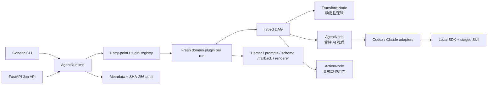

# Generic Agent Framework

这是一个本地优先的“确定性程序 + AI Agent”任务框架。程序负责可验证的解析、规则、合并、
校验、渲染和副作用门控；只有确实需要推理的步骤才交给本机 Codex 或 Claude Code SDK。

仓库包含两个独立可发布包：

- `agent-core`：领域无关的类型化工作流、Provider、Skill、插件注册、CLI、审计和 Web Job API。
- `trivy-ai-report`：第一个领域插件，负责 Trivy JSON v2 解析、整改 prompt、输出校验、
  本地降级规则和 HTML 模板。

`agent_core` 不导入 `trivy_ai_report`。新增 Linter Fixer、FinOps Optimizer、K8s Log Analyzer
等插件时，可以复用同一套执行、Provider、Web、安全和审计基础设施。

## 架构



核心边界：

- 所有插件输入继承 `ArtifactInput[Options]`，终态工件继承 `ArtifactOutput`。
- `TransformNode` 只做确定性转换；`AgentNode` 才能调用 Provider；`ActionNode` 是唯一受框架
  授权的副作用边界。
- Provider 只执行一次 `AgentRequest[T] -> ProviderResult[T]`。分批、重试、fallback 和领域
  身份校验属于 DAG/插件，不藏在 Provider 内。
- 插件注册表只保存 factory，每个 run 创建新的插件和 Provider；插件不得把请求状态放在单例中。
- prompt、Pydantic response schema、tool policy 和 Skill 都由插件显式声明并传入 Provider。

## 安装

需要 Python 3.10+。开发环境推荐使用 `uv`：

```bash
uv sync --locked --all-extras
uv run agent-core plugins list
```

生产安装可以按能力选择：

```bash
pip install agent-core                 # 只有 core/CLI，不依赖 FastAPI 或 Provider SDK
pip install 'agent-core[codex]'
pip install 'agent-core[claude]'
pip install 'agent-core[web]'
pip install 'agent-core[all]' trivy-ai-report
```

Codex adapter 使用 `openai-codex` 并复用本机 Codex 登录；Claude adapter 使用
`claude-agent-sdk`，凭据按 Claude Code/SDK 的标准方式配置。密钥不应写入仓库、options、URL
query 或报告。

## CLI

先生成 Trivy native JSON v2：

```bash
trivy image --format json --output trivy-report.json your-image:tag
```

然后通过同一个通用入口选择插件和 Provider：

```bash
uv run agent-core run \
  --plugin trivy \
  --provider codex \
  --input trivy-report.json \
  --output reports/trivy.html \
  --options-json '{"enrich_web":false,"use_bundled_skill":true}'
```

Claude 只需更换 Provider：

```bash
uv run agent-core run \
  --plugin trivy \
  --provider claude \
  --input trivy-report.json \
  --output reports/trivy.html
```

常用参数：

- `--model NAME`：覆盖 Provider 默认模型。
- `--skill PATH`：显式选择一个经过评审的 Skill；否则插件可提供自己的 bundled Skill。
- `--timeout-seconds N`：整个 workflow 的总 deadline；单次 Agent attempt 另有框架上限。
- `--action-mode disabled|dry_run|apply`：本次 run 允许的最高副作用级别，默认 `disabled`。
- `--force`：原子替换已有输出；默认 race-safe 地拒绝覆盖。

退出码：

| 代码 | 含义 |
| ---: | --- |
| `0` | 完整成功 |
| `2` | 参数、输入、插件/Provider 配置或输出路径错误 |
| `3` | AI 部分失败或不完整，但插件已生成确定性 fallback/部分工件 |
| `1` | 未预期的运行错误 |
| `130` | 用户中断或取消 |

CLI 默认把只含元数据和 SHA-256 的 JSONL 审计记录写到用户状态目录。可用
`AGENT_CORE_AUDIT_PATH=/absolute/path/audit.jsonl` 覆盖；原始输入、prompt、响应和工件不会写入
审计文件。

## Web Job API

Web 是可选依赖，并且默认只监听 loopback、禁用联网补充、禁用 ActionNode、副作用和远程
I/O：

```bash
uv run agent-core serve --host 127.0.0.1 --port 8000
```

显式开放能力时必须在服务端声明：

```bash
export AGENT_CORE_API_TOKEN='replace-with-a-secret'
uv run agent-core serve \
  --host 0.0.0.0 \
  --port 8000 \
  --allow-https-server artifacts.example.com:443 \
  --allow-web-enrichment \
  --max-action-mode dry_run
```

非 loopback bind 没有 bearer token 会在启动时失败。HTTPS source/sink 采用精确
`host:port` allowlist；只允许 HTTPS，无 userinfo/fragment/redirect，DNS 的所有地址都必须是
公网地址，并把实际连接固定到已校验的地址以防二次解析/rebinding。输入、输出、连接、读取、
写入、连接池和总请求都有上限。Web API 永不接受本地文件路径或 `file://`。

提交异步任务：

```bash
curl -sS -X POST http://127.0.0.1:8000/api/v1/runs \
  -H 'Content-Type: application/json' \
  -H "Authorization: Bearer $AGENT_CORE_API_TOKEN" \
  -d '{
    "plugin_id": "trivy",
    "provider": "codex",
    "source": {"type": "inline", "data": {
      "SchemaVersion": 2,
      "ArtifactName": "demo:latest",
      "ArtifactType": "container_image",
      "Results": []
    }},
    "sink": {"type": "artifact"},
    "options": {
      "enrich_web": false,
      "action_mode": "disabled",
      "parameters": {"use_bundled_skill": true}
    }
  }'
```

接口：

- `GET /livez`：仅表示进程存活。
- `GET /readyz`：插件、Provider 和 job manager 未就绪时返回 503。
- `GET /api/v1/plugins`、`GET /api/v1/plugins/{id}/schema`：只暴露启动时注册的插件/schema。
- `POST /api/v1/runs`：返回 202 和 `run_id`。
- `GET /api/v1/runs/{id}`：查看 queued/running/succeeded/degraded/failed/cancelled。
- `GET /api/v1/runs/{id}/artifact`：获取完成工件。
- `POST /api/v1/runs/{id}/cancel`：请求取消，取消会传递到 workflow 和 SDK。

内置 job manager 是有界、带 TTL 的单进程内存实现。多 worker/多实例生产部署必须注入持久化
queue/store，不能把不同 Uvicorn worker 的内存状态视为共享状态。

## DAG 与失败语义

- DAG 在运行前校验重复节点、未知依赖、环、类型、单值/多值 cardinality。
- fan-out 并发执行但结果保持输入顺序；run 级和 Provider 级并发都有边界。
- 只有声明为 retryable 的 Provider/timeout 错误会重试；默认最多 3 次，使用有界指数退避、
  jitter 和 `Retry-After`，并受 attempt timeout 与总 deadline 共同限制。
- AgentNode 可以声明领域 fallback。Trivy 插件在 Provider/SDK 不可用、超时或结构化结果不合格
  时生成保守建议，run 标记为 `degraded`。默认只有 `AgentCoreError` 类型的受控失败可以进入
  fallback；`TypeError` 等编程错误会让 run 明确失败，不会被静默伪装为成功。
- `ActionNode` 必须是 terminal。`disabled` 不执行，`dry_run` 只调用 preview handler，`apply`
  才调用 apply handler；Web 还会用服务端最大 action mode 再做一次 admission control。

## 编写新插件

插件是一个独立 Python 包，并在 `agent_core.domain_plugins` entry-point group 注册零参数 factory：

```toml
[project.entry-points."agent_core.domain_plugins"]
linter = "my_linter_plugin.plugin:create_plugin"
```

最小契约：

```python
from agent_core import ArtifactInput, ArtifactOutput, PluginManifest

class Options(...): ...
class Input(ArtifactInput[Options]): ...
class Output(ArtifactOutput): ...

class LinterPlugin:
    plugin_id = "linter"
    api_version = "1.0"
    manifest = PluginManifest(
        plugin_id=plugin_id,
        api_version=api_version,
        version="0.1.0",
        display_name="Linter Fixer",
        input_model=Input,
        options_model=Options,
        output_model=Output,
        required_capabilities=("structured_output",),
    )

    def create_workflow(self, runtime):
        # parse -> deterministic checks -> typed AgentNode -> validate/merge -> render
        ...

def create_plugin():
    return LinterPlugin()  # 每次调用必须返回新实例
```

插件负责：领域 parser、system/user prompt、Pydantic response model、领域 ID/事实交叉校验、
fallback、模板和可选 Skill。Core 负责：装配、DAG、Provider、重试/取消、registry、Web/CLI、
I/O policy 和审计。`tests/fixtures/toy-plugin` 是完全不依赖 Trivy 的可运行参考插件。

## Trivy 插件边界

Trivy 插件只支持 native JSON `SchemaVersion: 2`。解析、finding ID、严重度、版本事实、去重、
批次、fallback 合并、HTML autoescape/CSP 和最终文件写入都由 Python 决定。Agent 看不到原始
Description/引用，只收到受限事实；它不能修改 CVE、Severity、InstalledVersion 或
FixedVersion。离线模式会移除 AI 返回的联网证据。

插件 options：

- `enrich_web`：默认 `false`；为 true 时批次更小，并要求 run/Web 服务端允许 web access。
- `batch_size`：可选，1–100；未设置时离线 25、联网 10。
- `use_bundled_skill`：默认 `true`。

## 安全模型

- Skill 是指令供应链输入，只应使用已评审目录。loader 限制名称、UTF-8 frontmatter、文件数、
  单文件/总大小，拒绝 symlink、特殊文件和路径逃逸；每次调用复制到隔离临时 workspace。
- Codex 使用 ephemeral thread、read-only sandbox、deny-all approval；Claude 禁用 MCP，只开放
  `Skill`，以及请求被授权时的 `WebSearch`/`WebFetch`，不开放 Shell/文件写工具。
- Provider tool policy 由每个 `AgentRequest` 显式携带；Web run policy 可以进一步禁止任何插件
  请求联网，插件参数不能扩大服务端权限。
- 结构化输出必须通过 SDK schema、Pydantic、workflow 类型和领域 guardrail 多层验证。
- 审计只保留 bounded scalar metadata、时间、状态、大小和 payload SHA-256；URL query/fragment
  会在持久化前移除。
- 本框架提供安全默认值，但 AI 建议仍需人工评审、重新扫描和业务回归验证。

## 开发与验证

```bash
uv lock --check
uv sync --locked --all-extras
uv run ruff check packages/agent-core/src plugins/trivy-ai-report/src tests
uv run pytest
uv run pytest --cov=agent_core --cov=trivy_ai_report --cov-branch
uv build --package agent-core
uv build --package trivy-ai-report
```

默认测试不访问真实网络或付费 Provider。测试覆盖非 Trivy 插件端到端契约、并发隔离、重试、
deadline、取消、Action gating、Skill staging、Codex/Claude SDK 适配、entry-point discovery、
Web admission、SSRF/大小/timeout、job 生命周期、审计持久化和 wheel 资源。

只有显式设置 `RUN_LIVE_AGENT_TESTS=1` 才会运行 Codex/Claude 的付费 structured-output smoke；
Claude 还要求 `ANTHROPIC_API_KEY`，Codex 使用本机已登录状态。

## 从旧原型迁移

旧的 `trivy-report-codex`、`trivy-report-claude`、`trivy-report-gemini` 以及
`trivy_ai_report.providers` 已移除。使用 `agent-core run --plugin trivy --provider codex|claude`。
v1 核心只内置 Codex 和 Claude；Gemini 可作为独立 Provider 扩展后再加入，不再让领域插件维护
自己的 SDK 适配层。
